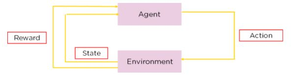

# RL QLearning
 Training an Agent in a 5x5 "FrozenLake" grid world to reach the Win state while avoiding holes in the world using Q Learning

# University of Galway
## Assignment 2 (Agents, Multi-Agent Systems & Reinforcement Learning)
## Dr. Patrick Mannion

## 1. Aim
The “deterministic” FrozenLake is a toy problem from the so-called “grid world” category of problems. In this problem the agent
lives in a square grid and can move in 4 directions, “up”, “down”, “left” and “right”. The agent always starts in the top-left position and its
goal is to reach the bottom-right position on the grid while avoiding various holes placed in the grid.

## 2. Theory/Working:
The FrozenLake is a grid of 5x5 matrix where the agent must start at (0, 0) and navigate through to reach the Win State (4, 4) which
is the bottom right part of the grid. There are various holes [(1, 0), (1, 3), (3, 1), (4, 2)] present in the environment which the agent must try
to avoid. The agent in this puzzle can move in four directions—"up," "down," "left," and "right"—and lives in a grid of squares.

  <figure>
  
  <figcaption>Fig 1. Components of Q-learning </figcaption>
  </figure>

A move to the "right" will always take the agent to the cell that is immediately to its right since actions are deterministic. But the
ice of the FrozenLake has holes, and the agent will drown if it falls in. The agent's status is unaffected by any activity that causes it to leave
the grid. The fundamental tenet of this philosophy is that the agent must select the optimum course through the environment to arrive at the
goal with the highest rewards it is mathematically capable of calculating while iteratively learning in the environment, using an algorithm
called Q-learning.

Given the agent's present state, Q-learning is a model-free, off-policy reinforcement learning technique that will determine the
appropriate course of action. The agent will choose what to do next based on its location in the surroundings [2]. To accomplish this, it
might devise its own set of rules or might deviate from the prescribed course of action. This indicates that there is no real need for a policy,
which is why it is referred to as off-policy [2]. When an agent is model-free, it leverages expectations of the environment's response to make
decisions about how to proceed. Trial and error are used instead of the incentive system to learn [2]. For each location in the grid, the
maximum Q-values (Q(S, A): used to assess the quality of an action, A, taken at a specific state, S) are generated at the end of the training
session, and we can keep an eye on how the agent can navigate to find the best reward values it can find to navigate the environment while
considering the holes.

To generate new Q(S, A) values for each state for a particular action, the Bellman equation is used. It finds the future state of our
agent by using the present state, the reward connected to that state, the maximum anticipated reward, and a discount rate that gauges its
significance to the current state. The learning rate controls how quickly or slowly the model will pick up new information.
$$Q = Q_{old}(S, A) + \alpha \times [R(S, A) + \gamma \times [Q_{max}^\prime(S, A) - Q(S, A)]$$

$\alpha$ is the learning rate set by the user which determines how fast or slow the agent/model learns at the given rate, while γ is the
discount rate to find significance to the current state. By randomly selecting between exploration and exploitation, Epsilon-Greedy is a
straightforward strategy for balancing discovery and exploitation. Epsilon refers to the probability of deciding to explore, and the
epsilon-greedy, with a low probability of exploring, exploits most of the time.
$$\epsilon = max(0.00, \epsilon \times (1.0 - decay-rate)$$

## 3. Conclusion:
The outcomes we discovered when training the agent are fairly encouraging, and when compared to one another, they exhibit a similar general feeling. Nevertheless, when thoroughly examined, there is a significant difference in the agent's environmental vigilance and state-action value improvement over time. When we look at the spectrum of incentives an agent can get during the training phase, as shown above, we can see that the models are diverse. A model's adjustment to the optimal values discovered during training can be seen in the divergence, which also demonstrates how greedy a model may become if properly configured. A greedy search for the optimal path can flourish in this setting, but only if it is taught gradually. A faster training α and a small discount rate may deteriorate the performance of the agent and so it needs to be slowly trained on the grid world to get the best outcomes possible. Although going even minimal may also be a reason for an agent deterioration in Q-values and so the balance must be kept well. Overall, the experiment was a successful attempt in showing the agent behavior over time for each hyperparameter setting. The best max Q-values we find were in setting 2 where we introduced a decay rate on the default parameters while the least divergence in rewards was found when the hyperparameter values were minimized as shown.

To achieve the greatest results, the agent must be taught gradually in the grid world because a rapid training process and a low discount rate could harm the agent's effectiveness. Yet, even slight deviations could lead to an agent's Q-values deteriorating, therefore it's important to maintain the right balance. Overall, the experiment was a successful attempt to demonstrate the behaviour of the agent over time for each configuration of the hyperparameters. Setting 2 where we added a decay rate to the default parameters produced the best maximum Q-values, but the setting where the hyperparameter values were minimized as shown produced the least reward divergence.

---
Reference:
1. D. P. Mannion, “CT5130 CT5134 Reinforcement Learning Assignment 2 Document,” University of Galway, Galway, Ireland, 2023.
2. M. Banoula, “What Is Q-Learning: The Best Guide To Understand Q-Learning,” SimpliLearn, 22 February 2023. [Online]. Available: https://www.simplilearn.com/tutorials/machine-learning-tutorial/what-is-q-learning#what_is_qlearning.
3. S. Shawl, “Epsilon-Greedy Algorithm in Reinforcement Learning,” Geeks for Geeks, 10 January 2023. [Online]. Available: https://www.geeksforgeeks.org/epsilon-greedy-algorithm-in-reinforcement-learning/.
4. V. Mnih, K. Kavukcuoglu and D. e. a. Silver, “Human-level control through deep reinforcement learning,” Nature, vol. 518, no. 1, pp. 529-533, 2015.
